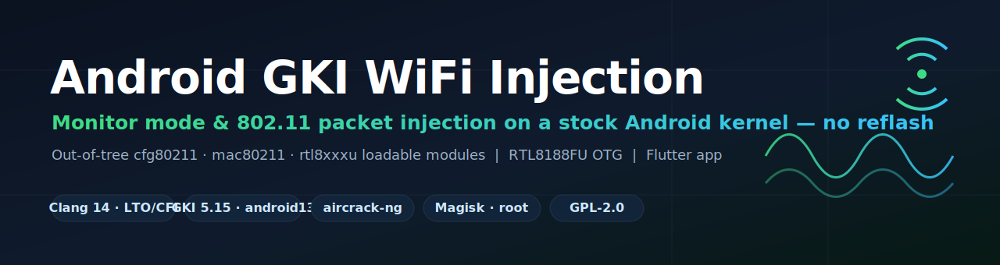
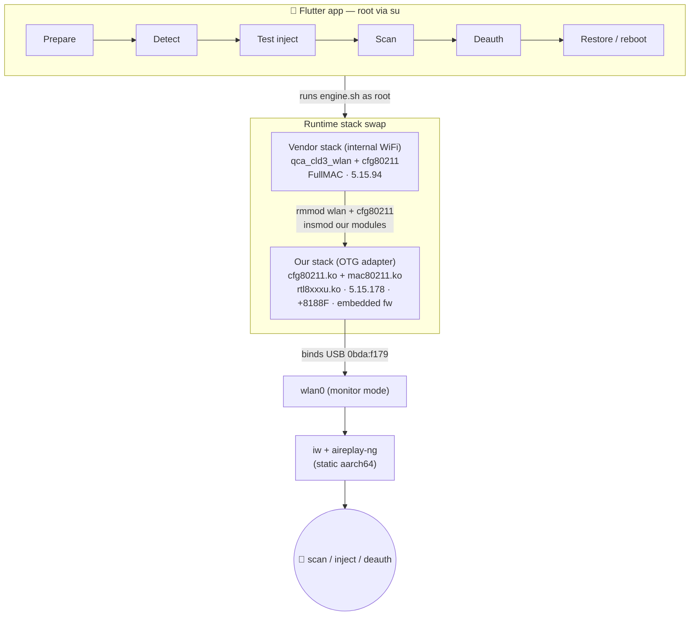

<p align="center">
  
</p>

<p align="center">
  <b>English</b> ·
  <a href="docs/i18n/README.ar.md">العربية</a> ·
  <a href="docs/i18n/README.fr.md">Français</a> ·
  <a href="docs/i18n/README.de.md">Deutsch</a> ·
  <a href="docs/i18n/README.zh.md">中文</a> ·
  <a href="docs/i18n/README.ko.md">한국어</a> ·
  <a href="docs/i18n/README.hi.md">हिन्दी</a>
</p>

# Android GKI WiFi Injection — OTG monitor-mode & deauth on a stock kernel

<p align="center">
  
  
  
  
  
  
</p>

> **WiFi monitor mode & 802.11 packet injection on a stock Android phone** by cross-compiling `cfg80211` + `mac80211` + `rtl8xxxu` as loadable modules for a GKI kernel — no custom ROM, no kernel flash. A full reverse-engineering + kernel + mobile-app build, end to end.

Building a working **monitor-mode + packet-injection** WiFi stack for a **stock, locked-down Android 13 GKI kernel** — entirely as **loadable kernel modules** (no kernel reflash) — to drive an **OTG USB WiFi adapter (Realtek RTL8188FU)**, fronted by a **Flutter app**.

Target device: **Redmi Note 13 4G (`sapphire`, Qualcomm `khaje`/SM6225)**, kernel `5.15.178-android13-8`, rooted with Magisk.

> ⚠️ **Authorized testing only.** This was built and used only against the author's *own* networks for security research and learning. Deauthentication is disruptive and, against networks you don't own/operate, illegal in most jurisdictions. See [Legal & ethics](#legal--ethics).

---

## TL;DR

- Android GKI ships a **frozen-KMI** kernel with **no `mac80211`** and only a **Qualcomm out-of-tree `cfg80211`**. Out-of-the-box, no USB WiFi adapter can do monitor mode or injection.
- This project cross-builds **`cfg80211.ko` + `mac80211.ko` + `rtl8xxxu.ko`** against the **exact GKI source/`vmlinux.symvers`** so they load on the stock kernel (matching vermagic + full **LTO/CFI/SCS** with Clang 14), then **swaps** the vendor WiFi stack at runtime so the OTG adapter comes up.
- `rtl8xxxu` 8188F support (added upstream in Linux 6.5) is **backported into the 5.15 driver**, and the firmware is **embedded into the module** to dodge Android's SELinux firmware-loader restrictions.
- A **Flutter app** orchestrates the whole thing as root: swap stack → detect adapter → scan → injection test (`aireplay-ng -9`) → deauth.
- **Finding:** the **internal Qualcomm WiFi can be forced into monitor mode** (`con_mode=4`) for *sniffing*, but its firmware **does not support injection** — so deauth on the internal chip is impossible. The OTG adapter is the only injection-capable path.

---

## Why this is hard (the GKI problem)

Modern Android phones run a **Generic Kernel Image (GKI)**: a Google-built kernel binary with a **stable, frozen Kernel Module Interface (KMI)**. Vendor functionality ships as separate modules. For WiFi pentesting this is hostile:

| Obstacle | Detail |
|---|---|
| **No `mac80211`** | The GKI kernel doesn't build `mac80211` at all; the Qualcomm WiFi driver is FullMAC and uses its own `cfg80211`. |
| **Vendor `cfg80211`** | The loaded `cfg80211` is a Qualcomm out-of-tree module (vermagic `5.15.94`), whose module↔module symbol CRCs **don't match** stock ACK (69/92 of `mac80211`'s imports differ). |
| **`MODVERSIONS` + exact vermagic** | Any module must match `5.15.178-android13-8-00021-g6f2f96be86b9-ab13729987` and the GKI symbol CRCs, or it's rejected. |
| **Full LTO + CFI + SCS** | `CONFIG_LTO_CLANG_FULL`, `CONFIG_CFI_CLANG` (non-permissive), `CONFIG_SHADOW_CALL_STACK` — a module built without matching Clang CFI **panics** the kernel on the first indirect call. Requires Clang 14 + matching flags. |
| **`nl80211` is a singleton** | You can't load a *second* `cfg80211` alongside the vendor one (the `nl80211` genl family collides) — so the stack must be **swapped**, not added. |
| **SELinux firmware loader** | The kernel can't read firmware from `/data/local/tmp` (`-13 EACCES`); standard firmware paths are read-only. |
| **No `rtl8xxxu` 8188F in 5.15** | Upstream 8188F support landed in Linux ~6.5. |

The key enabler: the swap is done as **loadable modules** — fully reversible (`rmmod`/reboot), and it never modifies a partition.

---

## How it works



### 1. Build the WiFi stack (matching the GKI kernel exactly)
- Pull the exact **GKI build** artifacts (`vmlinux.symvers`, build info) from `ci.android.com` for build `ab13729987`.
- Download the matching **ACK `kernel/common`** source (`android13-5.15`, commit `6f2f96be…`).
- Use **upstream Clang 14.0.0** (the kernel was built with AOSP clang r450784e / 14.0.7 — same CFI/LTO/SCS ABI).
- Force the exact vermagic via `.scmversion`, seed `vmlinux.symvers`, and build `cfg80211`/`mac80211`/`rtl8xxxu` as modules with `LLVM=1` (full LTO + CFI).

### 2. Backport RTL8188F into `rtl8xxxu`
- Take the internally-consistent **6.6 `rtl8xxxu`** (which has `rtl8xxxu_8188f.c`) and compile it against the **5.15** headers.
- Only **~20 errors**, all in two well-known mac80211 API changes:
  - `ieee80211_sta.deflink.*` → `ieee80211_sta.*` (pre-MLO),
  - `ieee80211_vif.cfg.*` → `ieee80211_vif.bss_conf.*`,
  - plus a few `ieee80211_ops` signature shims (`bss_info_changed` `u64`→`u32`, `start_ap`/`conf_tx` dropped link args, `ieee80211_beacon_get` arity, drop `wake_tx_queue`).

### 3. Embed the firmware
- `request_firmware("rtlwifi/rtl8188fufw.bin")` fails under SELinux from `/data/local/tmp`. The driver is patched to use a **C array of the 21 KB firmware** compiled into the module — no filesystem lookup.

### 4. Userspace tooling (static aarch64)
- `iw` (+ static `libnl`), `aireplay-ng` / `airodump-ng` (+ static `OpenSSL`/`libnl`), `iwpriv` (wireless-tools) — all cross-compiled fully static so they run under Android with no shared libs.

### 5. The app
- Bundles the modules + firmware + static tools, extracts them as root, runs `engine.sh` for each step. Internal WiFi/ADB drop during the swap (single USB-C port → operate standalone, or over Bluetooth PAN ADB).

---

## Repository layout

```
.
├── app/ (otgdeauth/)        Flutter app — UI + root orchestration
│   ├── lib/main.dart
│   └── assets/payload/engine.sh   the root engine (setup/detect/scan/test/deauth/restore)
├── driver/ (rtl8xxxu_build/) Modified rtl8xxxu (6.6 backported to 5.15) + embedded firmware
├── tools/
│   ├── deauth.c             minimal raw-socket 802.11 deauth injector (fallback)
│   └── build_tools.sh       cross-build iw / aireplay-ng / iwpriv (static aarch64)
├── scripts/
│   └── build_modules.sh     fetch GKI source + Clang 14, build cfg80211/mac80211/rtl8xxxu
└── docs/                    deep-dive notes
```

> The multi-GB downloads (GKI kernel source, Clang/LLVM, OpenSSL/libnl/aircrack source trees) and all build outputs are **git-ignored** — the scripts regenerate them.

---

## Build

Prereqs (Debian/Kali host): `git make clang lld bc bison flex python3 curl unzip aarch64-linux-gnu-gcc`, Flutter + Android SDK/NDK.

```bash
# 1. Build the kernel modules for your exact GKI build (edit the build/SHA vars inside if your kernel differs)
./scripts/build_modules.sh           # -> cfg80211.ko, mac80211.ko, rtl8xxxu.ko

# 2. Build the static userspace tools
./tools/build_tools.sh               # -> iw, aireplay-ng, airodump-ng, iwpriv

# 3. Stage them into the app and build the APK
cp *.ko rtl8188fufw.bin iw deauth aireplay-ng airodump-ng app/assets/payload/
cd app && flutter build apk          # release APK is debug-signed and installable
```

Match-your-device note: the modules are pinned to one GKI build (`vermagic` + `vmlinux.symvers`). For a different kernel, set the GKI **build number** and **`kernel/common` commit** in `scripts/build_modules.sh` (find them in `uname -r` / `/proc/version`).

## Usage (app)

1. **Prepare** — grant root in the Magisk prompt; swaps in the module stack.
2. Plug in the OTG adapter → **Detect** (`wlan0`).
3. **Test inject** — runs `aireplay-ng -9`; expect *"Injection is working!"*.
4. **Scan** → tap **Deauth** on a network **you own**.
5. **Restore** — reboot returns the internal WiFi to normal.

---

## Key findings

- ✅ **Stock GKI kernels can run a full out-of-tree WiFi stack** (`cfg80211`+`mac80211`+driver) as modules, including under full LTO/CFI/SCS, if you match the toolchain and `vmlinux.symvers`.
- ✅ **RTL8188FU injects** via mainline `rtl8xxxu` (backported), confirmed with `aireplay-ng -9`.
- ✅ **Embedding firmware** is a clean way around Android's SELinux firmware-loader sandbox.
- ❌ **Internal Qualcomm WiFi cannot inject.** `con_mode=4` yields a real monitor interface (sniffing works, channel set via the proprietary `setMonChan` ioctl), but the firmware monitor path is **capture-only** — `aireplay` injection fails. This matches the well-documented Qualcomm limitation.

---

## Legal & ethics

This repository documents security research performed by the author on **their own devices and networks**. Sending deauthentication frames disrupts service and is **illegal against networks you do not own or have written authorization to test** (e.g., US Computer Fraud and Abuse Act, UK Computer Misuse Act, and equivalents). Use it only for authorized testing, education, and defensive research. The authors accept no liability for misuse.

## Project

- 🌍 **Languages:** [English](README.md) · [العربية](docs/i18n/README.ar.md) · [Français](docs/i18n/README.fr.md) · [Deutsch](docs/i18n/README.de.md) · [中文](docs/i18n/README.zh.md) · [한국어](docs/i18n/README.ko.md) · [हिन्दी](docs/i18n/README.hi.md)
- 📐 **Deep dive:** [`docs/TECHNICAL-NOTES.md`](docs/TECHNICAL-NOTES.md)
- 🤝 **Contributing:** [`CONTRIBUTING.md`](CONTRIBUTING.md) — porting to other devices/chipsets
- 🔒 **Security & responsible use:** [`SECURITY.md`](SECURITY.md)

## License & credits

- Licensed under **GPL-2.0** — it contains modified `rtl8xxxu`, `mac80211`, and `cfg80211` code from the Linux kernel (GPL-2.0).
- `rtl8xxxu` 8188F support by Bitterblue Smith and the Linux wireless community. `aircrack-ng`, `iw`/`libnl`, `wireless-tools`, and `linux-firmware` are the property of their respective authors.
- Built as a learning/research project.

---

### Suggested GitHub topics

Add these under the repo's ⚙️ *About → Topics* for discoverability:

`android` · `gki` · `kernel-module` · `wifi` · `monitor-mode` · `packet-injection` · `802-11` · `rtl8xxxu` · `rtl8188fu` · `mac80211` · `cfg80211` · `aircrack-ng` · `deauth` · `wifi-security` · `penetration-testing` · `magisk` · `root` · `flutter` · `cross-compilation` · `reverse-engineering` · `qualcomm` · `nethunter` · `wireless-security`

<details>
<summary><b>Keywords</b> (search relevance)</summary>

Android WiFi monitor mode, packet injection on Android, RTL8188FU monitor mode, rtl8xxxu Android, GKI kernel module build, out-of-tree mac80211 cfg80211 Android, aireplay-ng Android arm64 static, OTG WiFi adapter Android deauth, Magisk WiFi injection, Redmi Note 13 sapphire kernel, Qualcomm con_mode monitor, NetHunter alternative, Android 13 kernel 5.15 module signing vermagic CFI LTO, Flutter root app.
</details>
